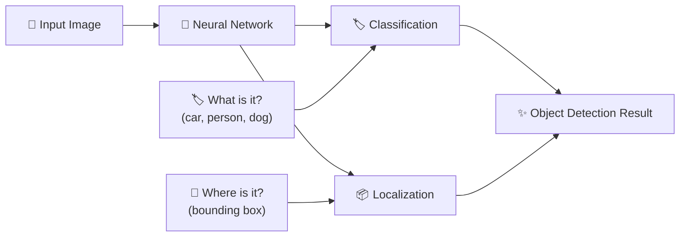
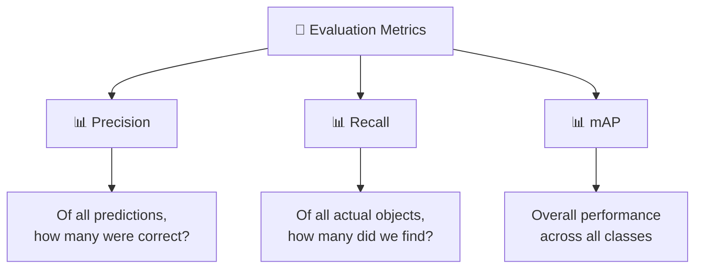
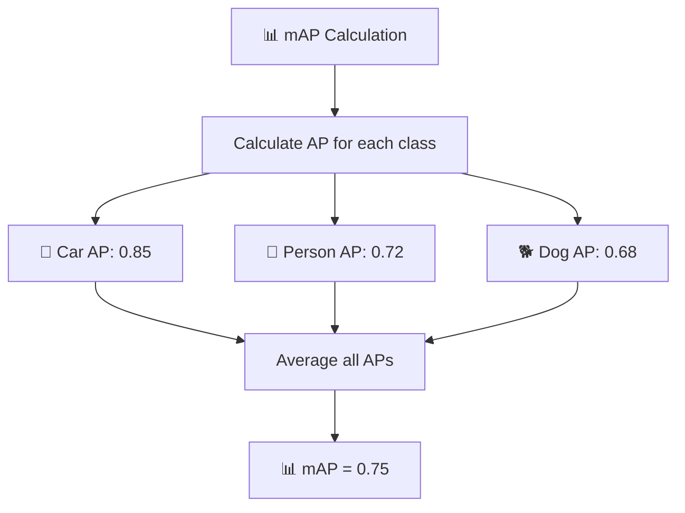
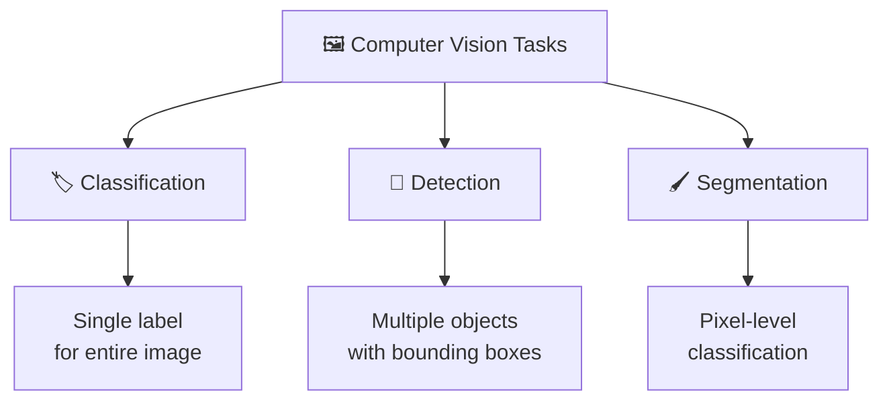

## 🔍 What is Object Detection?

**Object Detection** is a computer vision task that combines two fundamental operations:



### 🎯 **Two Main Tasks:**

#### 1️⃣ **Classification** 🏷️
```
Input: 📸 Image
Output: 🏷️ "car", "person", "dog"
```

#### 2️⃣ **Localization** 📍
```
Input: 📸 Image
Output: 📦 Bounding box coordinates
```

---

## 📦 Understanding Bounding Boxes

### 🔲 **What is a Bounding Box?**

A **bounding box** is a rectangle drawn around an object to indicate its location in the image.

```
Visual Representation:
┌─────────────────────────┐
│                         │
│    ┌─────────┐         │
│    │   🚗    │ ← Box   │
│    │  (car)  │         │
│    └─────────┘         │
│                         │
└─────────────────────────┘
```

### 📐 **Coordinate Systems:**

#### **Traditional Format:** (x₁, y₁, x₂, y₂)
```
(0,0) ──────────────────→ x
│     ┌─────────────────┐
│     │ (x₁,y₁)         │
│     │   ┌─────────┐   │
│     │   │  Object │   │
│     │   └─────────┘   │
│     │         (x₂,y₂) │
│     └─────────────────┘
↓
y
```

#### **YOLO Format:** (center_x, center_y, width, height)
```
(0,0) ──────────────────→ x
│     ┌─────────────────┐
│     │                 │
│     │   ┌─────────┐   │
│     │   │    ●    │   │ ← Center point
│     │   │ (cx,cy) │   │
│     │   └─────────┘   │
│     │      w × h      │
│     └─────────────────┘
↓
y
```

### 🔄 **Format Conversion:**
```python
# Traditional → YOLO
center_x = (x1 + x2) / 2
center_y = (y1 + y2) / 2
width = x2 - x1
height = y2 - y1

# YOLO → Traditional  
x1 = center_x - width/2
y1 = center_y - height/2
x2 = center_x + width/2
y2 = center_y + height/2
```

---

## 🎯 Confidence Score

### 📊 **What is Confidence Score?**

The **confidence score** represents how certain the model is about its prediction.

```mermaid
graph LR
    A[🖼️ Image] --> B[🧠 Model]
    B --> C[🏷️ Class: "Car"]
    B --> D[📊 Confidence: 0.92]
    
    D --> E["92% sure it's a car"]
    D --> F["8% uncertainty"]
```

### 📈 **Confidence Scale:**
```
0.0 ──────────────────────────────────── 1.0
│                                         │
No Confidence                    Full Confidence
│                                         │
0%                                      100%

Examples:
├── 0.15 (15%) - Very uncertain
├── 0.50 (50%) - Neutral threshold
├── 0.75 (75%) - Good confidence
└── 0.92 (92%) - High confidence ✅
```

### 🎚️ **Confidence Thresholding:**
```python
# Filter predictions by confidence
if confidence_score >= 0.5:  # 50% threshold
    accept_prediction()
else:
    reject_prediction()
```

---

## 🎯 IoU (Intersection over Union)

### 🔄 **What is IoU?**

**IoU** measures how well the predicted bounding box overlaps with the ground truth (actual) bounding box.

```
Formula: IoU = Area of Overlap / Area of Union
```

### ⚪ **Visual Explanation:**

#### **Perfect Match (IoU = 1.0):**
```
┌─────────────────┐
│                 │
│  ┌───────────┐  │
│  │ 🟦🟥 Both │  │ ← Blue (true) = Red (predicted)
│  │   boxes   │  │
│  └───────────┘  │
│                 │
└─────────────────┘
```

#### **Good Match (IoU = 0.7):**
```
┌─────────────────┐
│                 │
│  ┌───────────┐  │
│  │🟦🟥Overlap│  │ ← 70% overlap
│  │   area    │  │
│  └─┬─────────┘  │
│    │🟥 Predicted│
│    └─────────────┤
│                 │
└─────────────────┘
```

#### **Poor Match (IoU = 0.2):**
```
┌─────────────────┐
│ ┌─────┐         │
│ │🟦   │  ┌────┐ │ ← Only 20% overlap
│ │True │  │🟥  │ │
│ └─────┘  │Pred│ │
│          └────┘ │
└─────────────────┘
```

### 📊 **IoU Quality Thresholds:**

| IoU Range | Quality | Usage |
|-----------|---------|-------|
| **0.9 - 1.0** | 🟢 Excellent | Perfect detection |
| **0.7 - 0.9** | 🟡 Good | COCO evaluation |
| **0.5 - 0.7** | 🟠 Acceptable | Pascal VOC |
| **0.3 - 0.5** | 🔴 Poor | Needs improvement |
| **0.0 - 0.3** | ❌ Very Poor | False positive |

---

## 📊 Evaluation Metrics

### 🎯 **Precision vs Recall**



### 🔍 **Detailed Breakdown:**

#### **Precision** 🎯
```
Question: "Of all the cars I predicted, how many were actually cars?"

Precision = True Positives / (True Positives + False Positives)

Example:
- Predicted 10 cars
- 8 were actually cars ✅
- 2 were false alarms ❌
- Precision = 8/10 = 0.8 (80%)
```

#### **Recall** 📊
```
Question: "Of all the actual cars in the image, how many did I find?"

Recall = True Positives / (True Positives + False Negatives)

Example:
- 12 actual cars in image
- Found 8 cars ✅
- Missed 4 cars ❌
- Recall = 8/12 = 0.67 (67%)
```

### 🏆 **mAP (mean Average Precision)**

**mAP** combines precision and recall across all classes to give an overall performance score.



### 📈 **Performance Visualization:**

```
High Precision, Low Recall:
┌─────────────────────────┐
│ 🎯🎯🎯                 │ ← Found few, but accurate
│                         │
│     ❌ ❌ ❌           │ ← Missed many objects
└─────────────────────────┘

Low Precision, High Recall:
┌─────────────────────────┐
│ 🎯❌🎯❌🎯❌🎯❌       │ ← Found many, but inaccurate
│                         │
│                         │
└─────────────────────────┘

Balanced (Good Model):
┌─────────────────────────┐
│ 🎯🎯🎯🎯              │ ← Found most, high accuracy
│                         │
│         ❌              │ ← Few misses
└─────────────────────────┘
```

---

## 🎨 Computer Vision Task Comparison

### 📊 **Task Overview:**



### 🎯 **Detailed Comparison:**

#### **1️⃣ Image Classification** 🏷️
```
Input:  📸 [Entire Image]
Output: 🏷️ "This is a cat"

Visual:
┌─────────────────────┐
│                     │
│        🐱          │
│      (cat)          │
│                     │
└─────────────────────┘
Result: "Cat" (Single Label)
```

#### **2️⃣ Object Detection** 🎯
```
Input:  📸 [Image with multiple objects]
Output: 🏷️ + 📦 "Dog at (x1,y1,x2,y2)", "Cat at (x3,y3,x4,y4)"

Visual:
┌─────────────────────┐
│  ┌──────┐          │
│  │ 🐕   │ Dog      │
│  └──────┘          │
│           ┌──────┐ │
│           │ 🐱   │ │ Cat
│           └──────┘ │
└─────────────────────┘
Result: Multiple labeled boxes
```

#### **3️⃣ Semantic Segmentation** 🖌️
```
Input:  📸 [Complex scene]
Output: 🎨 Pixel-wise colored mask

Visual:
┌─────────────────────┐     ┌─────────────────────┐
│                     │ →   │🟦🟦🟦🟦🟦🟦🟦🟦🟦 │
│   🚗    🏠    🌳   │     │🟥🟥🟥🟩🟩🟩🟫🟫🟫 │
│                     │     │🟥🟥🟥🟩🟩🟩🟫🟫🟫 │
└─────────────────────┘     └─────────────────────┘
Original                    Segmented (each color = class)
```

### 📊 **Task Comparison Table:**

| Aspect | 🏷️ Classification | 🎯 Detection | 🖌️ Segmentation |
|--------|------------------|-------------|-----------------|
| **Output** | Single label | Multiple boxes + labels | Pixel masks |
| **Complexity** | ⭐ Simple | ⭐⭐⭐ Medium | ⭐⭐⭐⭐⭐ Complex |
| **Speed** | 🟢 Fast | 🟡 Medium | 🔴 Slow |
| **Use Cases** | Image tagging | Autonomous driving | Medical imaging |
| **Example** | "This is a dog" | "Dog at (10,20,50,80)" | Pixel-wise dog mask |

---

## 🛠️ Practical Examples

### 🚗 **Autonomous Driving Example:**

```
Scene: Street with cars and pedestrians

┌─────────────────────────────────────┐
│                                     │
│  ┌──────┐              ┌─────┐     │
│  │ 🚗   │ Car          │ 👤  │     │
│  │ 0.95 │ (95%)        │ 0.87│     │ Person (87%)
│  └──────┘              └─────┘     │
│                                     │
│      ┌──────────┐                  │
│      │    🚌    │ Bus (92%)        │
│      │   0.92   │                  │
│      └──────────┘                  │
└─────────────────────────────────────┘

Detection Results:
✅ Car: (25, 15, 75, 35) - Confidence: 0.95
✅ Person: (120, 10, 140, 40) - Confidence: 0.87  
✅ Bus: (50, 45, 110, 75) - Confidence: 0.92
```

### 🏥 **Medical Imaging Example:**

```
Task: Tumor Detection in X-ray

┌─────────────────────┐
│                     │
│    ┌─────┐         │
│    │ 🔴  │ Tumor   │ ← High precision needed
│    │0.78 │ (78%)   │   (IoU > 0.8 required)
│    └─────┘         │
│                     │
└─────────────────────┘

Requirements:
- High Recall: Don't miss any tumors
- High Precision: Minimize false alarms
- IoU > 0.8: Precise localization critical
```

---

