# 🚀 YOLO (You Only Look Once) - Complete Technical Guide

<div align="center">
  <h2>⚡ Real-Time Object Detection Revolution</h2>
  <p><em>"One look, infinite detections"</em></p>
</div>

---

## 🧠 What is YOLO?

**YOLO (You Only Look Once)** is a revolutionary object detection algorithm that detects all objects in an image **in a single forward pass** through a neural network.

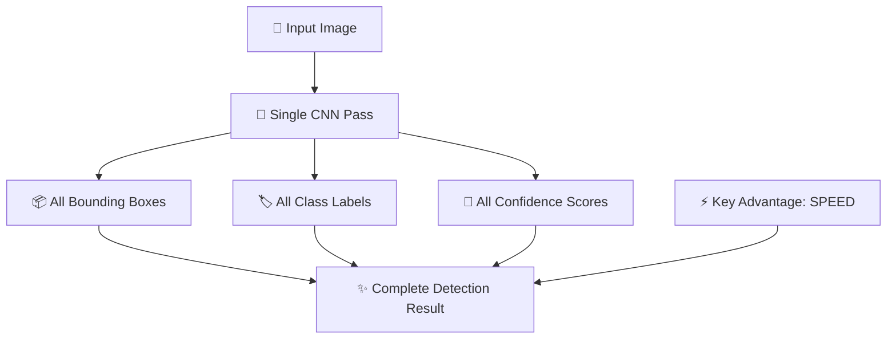

### 🔄 **YOLO vs Traditional Methods:**

#### **Traditional R-CNN Approach** 🐌
```
Step 1: 📸 Input Image
         ↓
Step 2: 🔍 Generate 2000+ region proposals
         ↓
Step 3: 🧠 Classify each region separately
         ↓
Step 4: 📦 Refine bounding boxes
         ↓
Step 5: ✨ Final result (SLOW!)
```

#### **YOLO Approach** ⚡
```
Step 1: 📸 Input Image
         ↓
Step 2: 🧠 Single CNN forward pass
         ↓
Step 3: ✨ All detections simultaneously (FAST!)
```

---

## 🎯 YOLO Core Concept: Grid-Based Detection

### 📊 **Grid Division Visualization:**

```
Original Image (640×640)          Grid Division (S×S)
┌─────────────────────────┐      ┌─┬─┬─┬─┬─┬─┬─┐
│                         │      ├─┼─┼─┼─┼─┼─┼─┤
│    🚗      👤          │  →   ├─┼─┼─┼─┼─┼─┼─┤
│                         │      ├─┼─┼─┼─┼─┼─┼─┤
│         🏠     🚲      │      ├─┼─┼─┼─┼─┼─┼─┤
│                         │      ├─┼─┼─┼─┼─┼─┼─┤
│    👤            🐕    │      ├─┼─┼─┼─┼─┼─┼─┤
│                         │      └─┴─┴─┴─┴─┴─┴─┘
└─────────────────────────┘      Each cell = responsible 
                                 for objects in that region
```

### 🎯 **Each Grid Cell Predicts:**

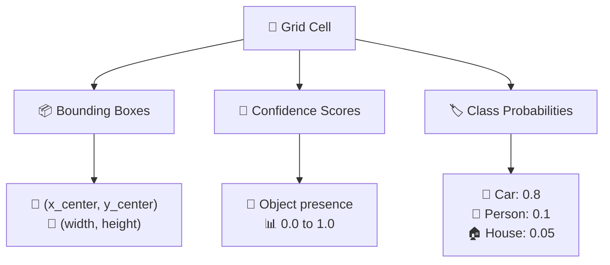

---

## ⚙️ YOLO Architecture Deep Dive

### 🏗️ **Network Structure:**

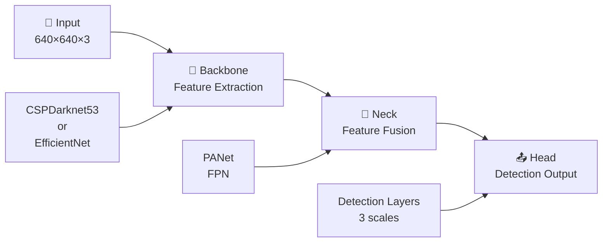

### 📊 **Output Tensor Structure:**

For a **7×7 grid** with **B=2 boxes** per cell and **C=80 classes**:

```
Output Shape: 7 × 7 × (2×5 + 80) = 7 × 7 × 90

Each cell outputs:
┌─────────────────────────────────────┐
│ Box 1: [x, y, w, h, conf]          │ ← 5 values
│ Box 2: [x, y, w, h, conf]          │ ← 5 values  
│ Class probs: [p1, p2, ..., p80]    │ ← 80 values
└─────────────────────────────────────┘
                Total: 90 values per cell
```

### 🎯 **Multi-Scale Detection (YOLOv3+):**

```
Input: 640×640
         ↓
┌─────────────────────────┐
│   Large Objects         │
│   Detection: 20×20      │ ← Detects large objects
└─────────────────────────┘
         ↓
┌─────────────────────────┐
│   Medium Objects        │
│   Detection: 40×40      │ ← Detects medium objects
└─────────────────────────┘
         ↓
┌─────────────────────────┐
│   Small Objects         │
│   Detection: 80×80      │ ← Detects small objects
└─────────────────────────┘
```

---

## 🚀 Why YOLO is Superior

### ⚡ **Speed Comparison:**

```mermaid
xychart-x
    title "Frames Per Second (FPS) Comparison"
    x-axis ["R-CNN", "Fast R-CNN", "Faster R-CNN", "SSD", "YOLO", "YOLOv8"]
    y-axis "FPS" 0 --> 100
    bar [0.5, 2, 5, 46, 45, 80]
```

### 📊 **Performance vs Speed Matrix:**

| Method | Speed (FPS) | Accuracy (mAP) | Real-time | Use Case |
|--------|-------------|----------------|-----------|----------|
| **R-CNN** | 🐌 0.5 | 🎯 66.0% | ❌ No | Research only |
| **Fast R-CNN** | 🐌 2.0 | 🎯 70.0% | ❌ No | Offline processing |
| **Faster R-CNN** | 🐌 5.0 | 🎯 73.2% | ❌ No | High accuracy needed |
| **SSD** | 🟡 46 | 🎯 74.3% | ✅ Yes | Mobile applications |
| **YOLO** | 🟢 45 | 🎯 63.4% | ✅ Yes | Real-time detection |
| **YOLOv8** | 🟢 80+ | 🎯 53.2% | ✅ Yes | **Best overall** |

---

## 🏗️ YOLO Evolution Timeline

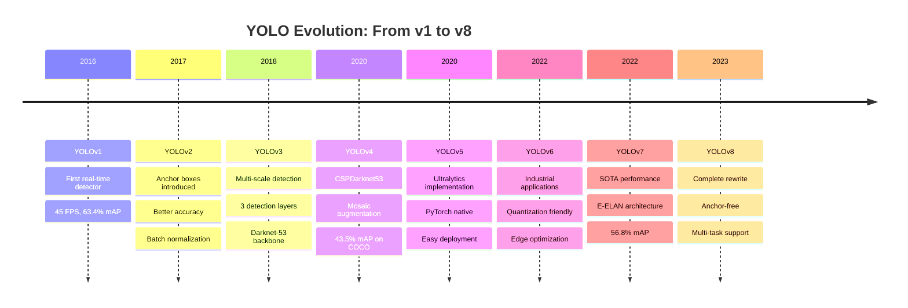

### 🎯 **Version Comparison Detail:**

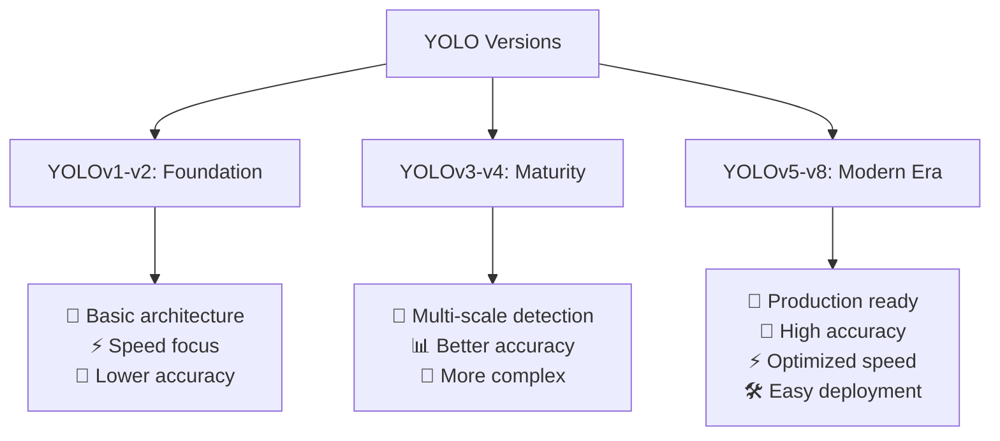

---

## 🔥 YOLOv8: The Current Champion

### ✨ **YOLOv8 Key Features:**

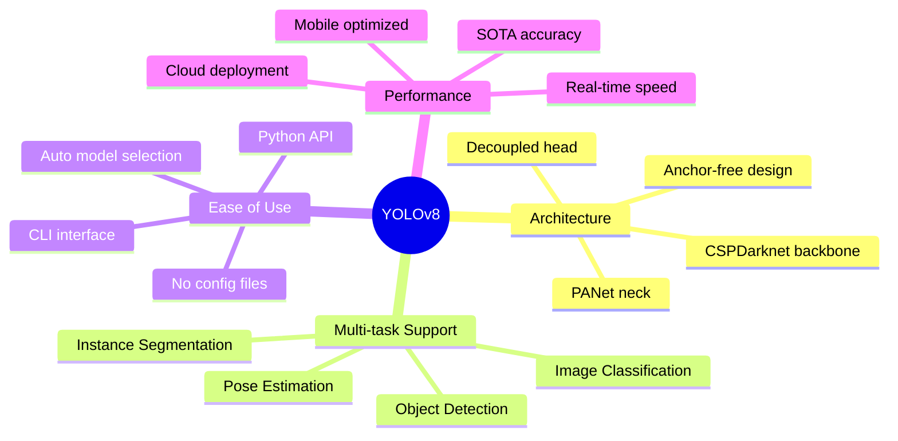

### 📊 **YOLOv8 Model Variants:**

| Model | Size (MB) | Speed (ms) | mAP50-95 | Parameters | Use Case |
|-------|-----------|------------|----------|------------|----------|
| **YOLOv8n** | 6.2 | 1.47 | 37.3% | 3.2M | 📱 Mobile, Edge devices |
| **YOLOv8s** | 21.5 | 2.61 | 44.9% | 11.2M | 💻 CPU inference |
| **YOLOv8m** | 49.7 | 5.09 | 50.2% | 25.9M | ⚖️ Balanced performance |
| **YOLOv8l** | 83.7 | 8.05 | 52.9% | 43.7M | 🎯 High accuracy |
| **YOLOv8x** | 136.7 | 12.81 | 53.9% | 68.2M | 🏆 Maximum accuracy |

### 🛠️ **YOLOv8 Installation & Usage:**

```bash
# Installation
pip install ultralytics

# Basic usage
yolo predict model=yolov8n.pt source='https://ultralytics.com/images/bus.jpg'

# Training custom model
yolo train model=yolov8n.pt data=coco128.yaml epochs=100 imgsz=640

# Validation
yolo val model=yolov8n.pt data=coco128.yaml

# Export to different formats
yolo export model=yolov8n.pt format=onnx
```

---

## 💻 YOLO Output Structure & Processing

### 📤 **YOLOv8 Output Format:**

```python
# Sample detection result
detections = [
    {
        "box": {
            "x1": 150,      # Top-left x
            "y1": 100,      # Top-left y  
            "x2": 350,      # Bottom-right x
            "y2": 300       # Bottom-right y
        },
        "confidence": 0.93,
        "class_id": 2,
        "class_name": "car"
    },
    {
        "box": {
            "x1": 400,
            "y1": 150,
            "x2": 450,
            "y2": 400
        },
        "confidence": 0.87,
        "class_id": 0,
        "class_name": "person"
    }
]
```

### 🔄 **Real-Time Detection Pipeline:**

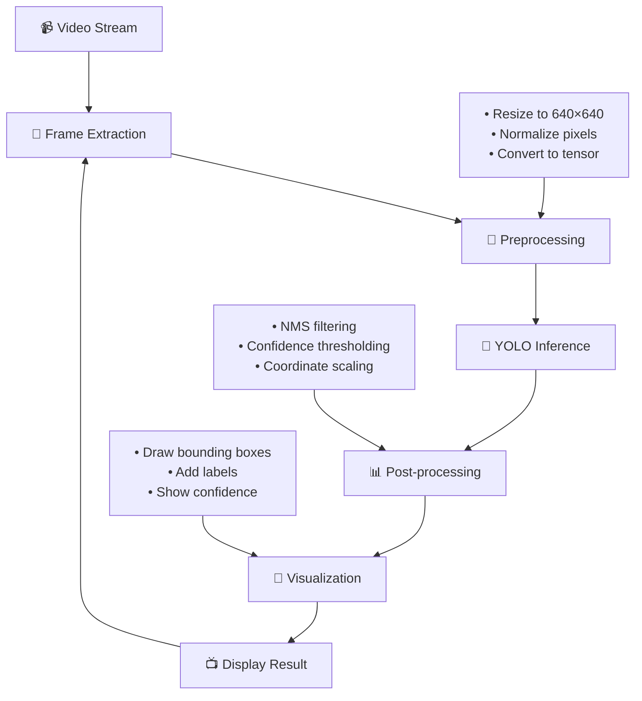

### ⚙️ **Post-Processing Steps:**

#### **1️⃣ Non-Maximum Suppression (NMS):**
```
Before NMS:                    After NMS:
┌─────────────────┐           ┌─────────────────┐
│  ┌──────┐       │           │  ┌──────┐       │
│  │ 🚗   │ 0.9   │           │  │ 🚗   │ 0.9   │
│  │┌─────┤       │    →      │  │      │       │
│  ││ 🚗  │ 0.7   │           │  │      │       │
│  │└─────┘       │           │  └──────┘       │
└─────────────────┘           └─────────────────┘
Multiple overlapping boxes    Single best box
```

#### **2️⃣ Confidence Thresholding:**
```python
# Filter detections by confidence
filtered_detections = []
for detection in raw_detections:
    if detection.confidence >= 0.5:  # 50% threshold
        filtered_detections.append(detection)
```

---

## 🎯 Real-Time Detection Workflow

### 🔄 **Step-by-Step Process:**

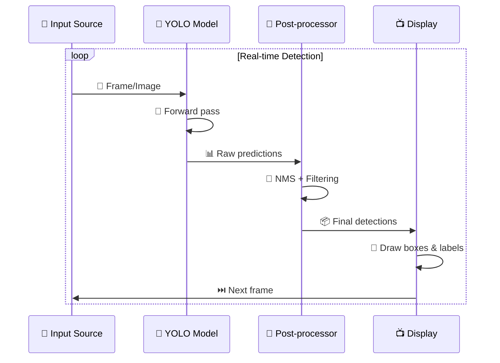

### ⏱️ **Performance Optimization:**

| Optimization | Description | Speed Gain | Accuracy Impact |
|-------------|-------------|------------|-----------------|
| **Model Size** | Use YOLOv8n instead of YOLOv8x | 🟢 8x faster | 🟡 -16% mAP |
| **Input Resolution** | 416×416 instead of 640×640 | 🟢 2x faster | 🟡 -5% mAP |
| **Batch Processing** | Process multiple frames together | 🟢 1.5x faster | 🟢 No impact |
| **GPU Acceleration** | CUDA/TensorRT optimization | 🟢 5-10x faster | 🟢 No impact |
| **Mixed Precision** | FP16 instead of FP32 | 🟢 1.5x faster | 🟢 Minimal impact |

---

## 🚑 Custom Training: Ambulance Detection Example

### 📊 **Training Pipeline:**

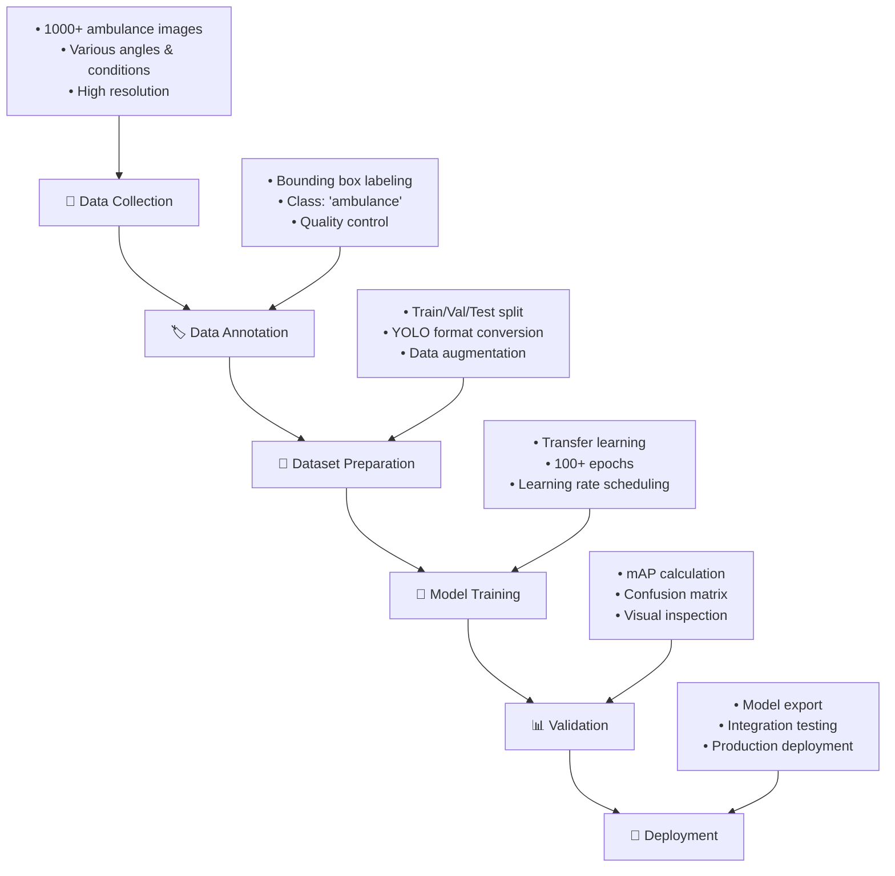

### 📁 **Dataset Structure:**

```
ambulance_detection/
├── 📂 images/
│   ├── 📂 train/           # 70% of data
│   │   ├── 🖼️ amb_001.jpg
│   │   ├── 🖼️ amb_002.jpg
│   │   └── ...
│   ├── 📂 val/             # 20% of data
│   │   ├── 🖼️ amb_501.jpg
│   │   └── ...
│   └── 📂 test/            # 10% of data
│       └── ...
├── 📂 labels/
│   ├── 📂 train/
│   │   ├── 📄 amb_001.txt  # YOLO format
│   │   ├── 📄 amb_002.txt
│   │   └── ...
│   ├── 📂 val/
│   └── 📂 test/
└── 📄 data.yaml            # Configuration file
```

### 📝 **Configuration File (data.yaml):**

```yaml
# Dataset configuration
path: ./ambulance_detection  # Root path
train: images/train          # Training images
val: images/val              # Validation images  
test: images/test            # Test images

# Number of classes
nc: 1

# Class names
names:
  0: ambulance

# Optional: Download script
# download: https://github.com/user/ambulance-dataset.git
```

### 🧠 **Training Command:**

```bash
# Train YOLOv8 on ambulance dataset
yolo train \
    model=yolov8n.pt \
    data=data.yaml \
    epochs=100 \
    imgsz=640 \
    batch=16 \
    device=0 \
    project=ambulance_detection \
    name=exp1
```

---

## 📊 Performance Monitoring & Metrics

### 📈 **Training Metrics Dashboard:**

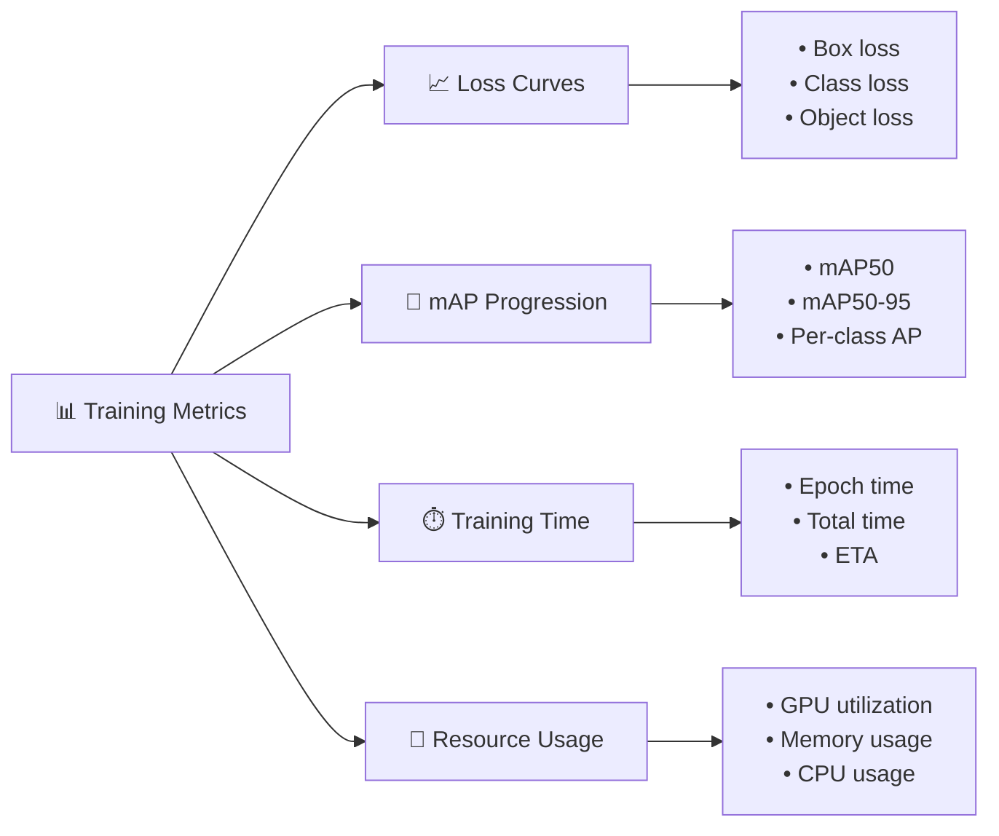

### 🎯 **Evaluation Results Format:**

```
Class     Images  Instances      P      R   mAP50  mAP50-95
all          100        150   0.89   0.92   0.915     0.634
ambulance    100        150   0.89   0.92   0.915     0.634

Speed: 1.5ms preprocess, 2.1ms inference, 1.2ms postprocess per image
```

---

## 🌟 Advanced YOLO Applications

### 🚗 **Autonomous Vehicles:**

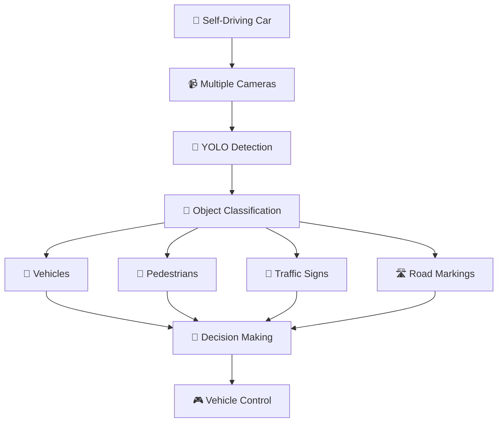

### 🏥 **Medical Imaging:**

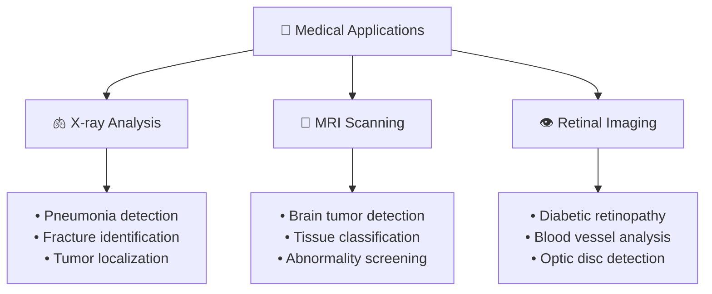

### 🏭 **Industrial Automation:**

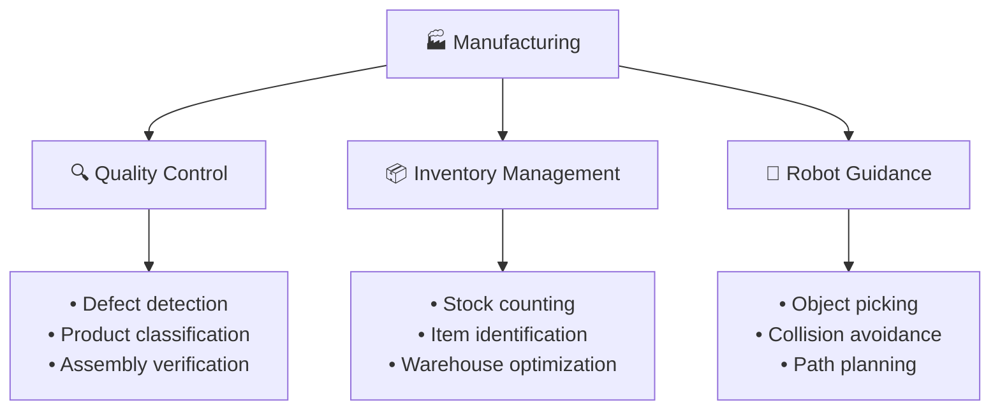

---

## 🛠️ Development Tools & Resources

### 📚 **Essential Learning Resources:**

| Resource Type | Name | Link | Rating |
|---------------|------|------|--------|
| 📖 **Official Docs** | Ultralytics Documentation | [docs.ultralytics.com](https://docs.ultralytics.com) | ⭐⭐⭐⭐⭐ |
| 🎥 **Video Tutorial** | YOLO Series (Hindi) | CodePerfect Channel | ⭐⭐⭐⭐ |
| 📝 **Blog Post** | YOLOv8 Deep Dive | Roboflow Blog | ⭐⭐⭐⭐ |
| 🧠 **Research Paper** | YOLOv8 Official Paper | ArXiv | ⭐⭐⭐⭐⭐ |
| 💻 **GitHub Repo** | Ultralytics YOLOv8 | GitHub | ⭐⭐⭐⭐⭐ |

### 🛠️ **Development Stack:**

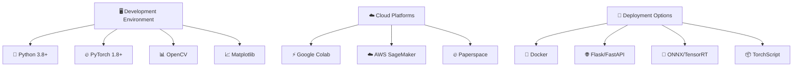

### 🎯 **Performance Benchmarking:**

```python
# Benchmark different YOLO models
import time
from ultralytics import YOLO

models = ['yolov8n.pt', 'yolov8s.pt', 'yolov8m.pt', 'yolov8l.pt', 'yolov8x.pt']
results = {}

for model_name in models:
    model = YOLO(model_name)
    
    # Measure inference time
    start_time = time.time()
    results_batch = model('test_image.jpg')
    end_time = time.time()
    
    inference_time = end_time - start_time
    results[model_name] = {
        'inference_time': inference_time,
        'model_size': model.model.get_parameter_count()
    }
    
print("Model Performance Comparison:")
for model, metrics in results.items():
    print(f"{model}: {metrics['inference_time']:.3f}s, {metrics['model_size']} params")
```

---

## 🎯 Summary & Best Practices

### ✅ **YOLO Implementation Checklist:**

- [ ] 🎯 **Choose appropriate model size** (nano for speed, extra-large for accuracy)
- [ ] 📊 **Prepare quality training data** (1000+ images per class minimum)
- [ ] 🏷️ **Ensure consistent annotation quality** (use tools like Roboflow)
- [ ] 🔧 **Implement proper preprocessing** (resize, normalize, augment)
- [ ] 📈 **Monitor training metrics** (loss curves, mAP progression)
- [ ] 🎯 **Validate on unseen data** (separate test set)
- [ ] ⚡ **Optimize for deployment** (quantization, pruning, TensorRT)
- [ ] 🔄 **Set up continuous evaluation** (performance monitoring)

