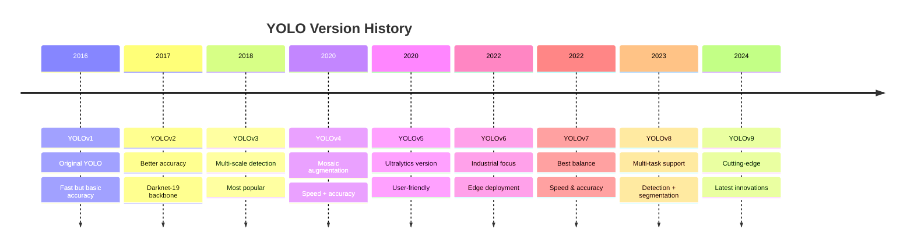
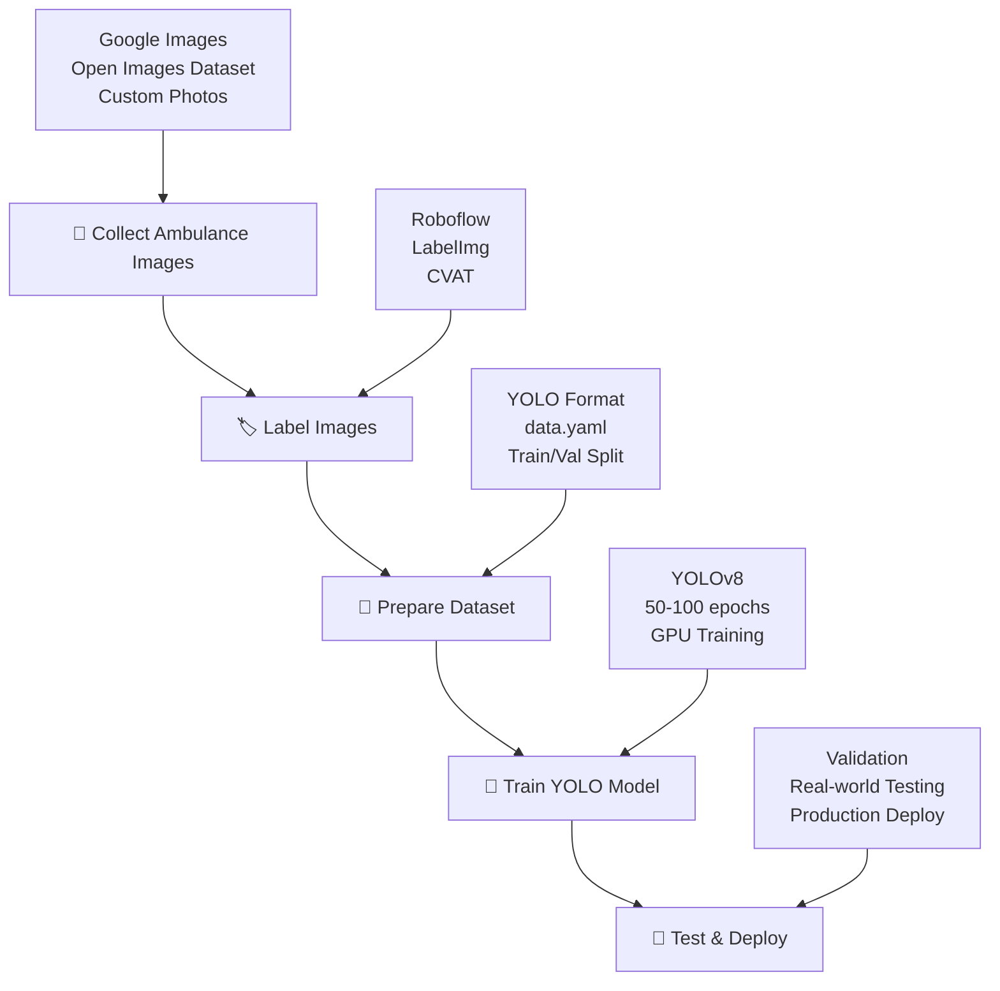
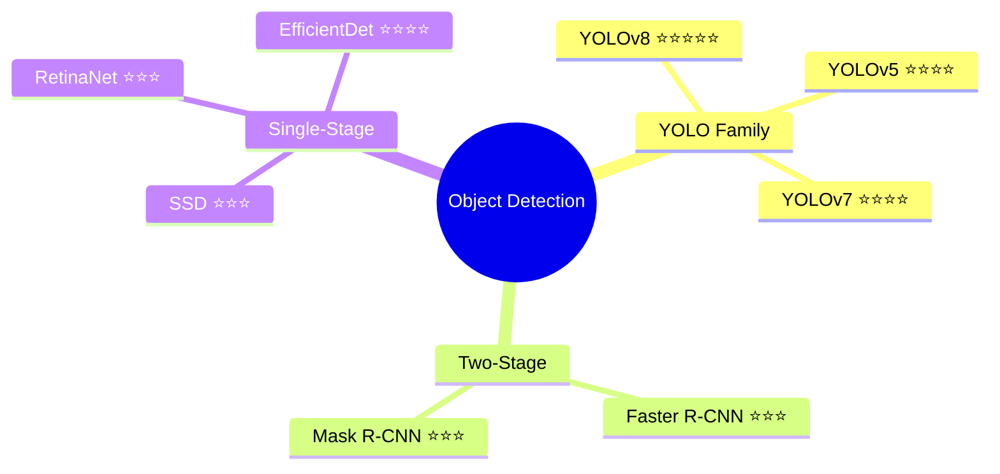

# 🎯 YOLO (You Only Look Once) - Complete Introduction

<div align="center">
  <h2>🚀 Real-Time Object Detection Made Simple</h2>
  <p><em>"Look once, detect everything!"</em></p>
</div>

---

## 🧠 What is YOLO?

**YOLO (You Only Look Once)** is a revolutionary **real-time object detection** system that processes entire images in a single pass through a neural network.

### 🔥 Key Features:
- ⚡ **Lightning Fast** - Real-time detection
- 🎯 **Single Pass** - One look, complete detection
- 📦 **Bounding Boxes** - Precise object localization
- 🏷️ **Multi-Class** - Identifies multiple object types

---

## 🔄 How YOLO Works

```
📸 Input Image → 🔲 Grid Division → 🧠 Neural Network → 📦 Detection Results
```

### Step-by-Step Process:

#### 1️⃣ **Image Input**
```
Original Image (416×416 pixels)
┌─────────────────────────┐
│    🚗   👤    🏠       │
│         🚲              │
│    👤      🚗          │
└─────────────────────────┘
```

#### 2️⃣ **Grid Division**
```
Divided into Grid (13×13 cells)
┌─┬─┬─┬─┬─┬─┬─┬─┬─┬─┬─┬─┬─┐
├─┼─┼─┼─┼─┼─┼─┼─┼─┼─┼─┼─┼─┤
├─┼─┼─┼─┼─┼─┼─┼─┼─┼─┼─┼─┼─┤
├─┼─┼─┼─┼─┼─┼─┼─┼─┼─┼─┼─┼─┤
└─┴─┴─┴─┴─┴─┴─┴─┴─┴─┴─┴─┴─┘
```

#### 3️⃣ **Prediction Per Cell**
Each grid cell predicts:
- 📍 **Bounding Box Coordinates** (x, y, width, height)
- 🎯 **Confidence Score** (0-1)
- 🏷️ **Class Probabilities** (car, person, bike, etc.)

---

## 📊 YOLO Evolution Timeline



### 🏆 Version Comparison

| Version | 🎯 Accuracy | ⚡ Speed | 🛠️ Ease of Use | 📱 Best For |
|---------|-------------|----------|----------------|-------------|
| **YOLOv1** | ⭐⭐ | ⭐⭐⭐⭐⭐ | ⭐⭐ | Learning basics |
| **YOLOv3** | ⭐⭐⭐⭐ | ⭐⭐⭐⭐ | ⭐⭐⭐ | Production apps |
| **YOLOv5** | ⭐⭐⭐⭐ | ⭐⭐⭐⭐ | ⭐⭐⭐⭐⭐ | Beginners |
| **YOLOv8** | ⭐⭐⭐⭐⭐ | ⭐⭐⭐⭐ | ⭐⭐⭐⭐⭐ | **Recommended** |

---

## 🚑 Adding Custom "Ambulance" Detection

### 🔍 Problem: Default YOLO Models Don't Detect Ambulances

**COCO Dataset** (default training data) has 80 classes:
```
✅ Car, Bus, Truck, Person, Bicycle
❌ Ambulance (not included)
```

### 💡 Solution: Train Custom YOLO Model

#### 🛠️ Step-by-Step Training Process:



#### 📁 Dataset Structure:
```
ambulance_detection/
├── 📂 images/
│   ├── 📂 train/
│   │   ├── 🖼️ ambulance_001.jpg
│   │   ├── 🖼️ ambulance_002.jpg
│   │   └── ...
│   └── 📂 val/
├── 📂 labels/
│   ├── 📂 train/
│   │   ├── 📄 ambulance_001.txt
│   │   ├── 📄 ambulance_002.txt
│   │   └── ...
│   └── 📂 val/
└── 📄 data.yaml
```

#### 📝 Sample data.yaml:
```yaml
# Training/Validation paths
train: images/train
val: images/val

# Number of classes
nc: 1

# Class names
names: ['ambulance']
```

---

## 💻 Code Implementation

### 🚀 Quick Start with YOLOv8:

#### Installation:
```bash
pip install ultralytics
```

#### Training Custom Model:
```bash
# Train on custom ambulance dataset
yolo task=detect mode=train model=yolov8n.pt data=data.yaml epochs=50 imgsz=640

# Monitor training
tensorboard --logdir runs/train
```

#### Inference:
```bash
# Detect ambulances in new images
yolo task=detect mode=predict model=best.pt source=test_image.jpg

# Real-time webcam detection
yolo task=detect mode=predict model=best.pt source=0
```

#### Python Script:
```python
from ultralytics import YOLO

# Load trained model
model = YOLO('best.pt')

# Run inference
results = model('ambulance_test.jpg')

# Display results
results[0].show()
```

---

## 📚 Learning Resources

### 🎥 **Video Tutorials:**

1. **🏆 Ultralytics Official**
   ```
   📺 YouTube: "Ultralytics YOLOv8 Tutorial"
   🔗 Channel: @ultralytics
   ⭐ Rating: 5/5 - Official documentation
   ```

2. **🎓 Nicholas Renotte**
   ```
   📺 Series: "Real-Time Object Detection"
   🔗 Channel: @NicholasRenotte
   ⭐ Rating: 5/5 - Beginner friendly
   ```

3. **🚀 Augmented Startups**
   ```
   📺 Tutorial: "Custom YOLO Training"
   🔗 Channel: @AugmentedStartups
   ⭐ Rating: 4/5 - Visual explanations
   ```

### 📖 **Documentation:**
- 🌐 **Official Docs**: https://docs.ultralytics.com
- 📝 **GitHub**: https://github.com/ultralytics/ultralytics
- 💬 **Community**: https://community.ultralytics.com

---

## 🔄 YOLO Alternatives



### 🏁 Performance Comparison:
| Algorithm | Speed (FPS) | Accuracy (mAP) | Use Case |
|-----------|-------------|----------------|----------|
| **YOLOv8** | 🟢 80+ | 🟢 50.2% | **Best Overall** |
| Faster R-CNN | 🟡 5-10 | 🟢 42.0% | High accuracy |
| SSD | 🟢 46 | 🟡 25.1% | Mobile apps |
| EfficientDet | 🟡 20-30 | 🟢 52.2% | Efficiency focused |

---

## 🎯 TL;DR - Quick Summary

### ✅ **Getting Started Checklist:**

- [ ] 📚 Understand YOLO basics
- [ ] 🛠️ Install Ultralytics YOLOv8
- [ ] 📸 Collect ambulance images (500+ recommended)
- [ ] 🏷️ Label images using Roboflow
- [ ] 📁 Prepare dataset in YOLO format
- [ ] 🧠 Train custom model (50-100 epochs)
- [ ] 🎯 Test and validate results
- [ ] 🚀 Deploy for real-world use

### 🏆 **Best Practices:**
1. **Start Simple**: Use YOLOv8n (nano) for faster training
2. **Quality Data**: More diverse, well-labeled images = better results
3. **Augmentation**: Use built-in augmentations for robustness
4. **Validation**: Always test on unseen data
5. **Iteration**: Fine-tune based on real-world performance

---

<div align="center">
  <h3>🎉 Ready to Detect Ambulances with YOLO? 🚑</h3>
  <p><strong>Choose YOLOv8 → Collect Data → Train → Deploy → Success!</strong></p>
  
  ```
  💡 Pro Tip: Start with pre-trained weights and fine-tune 
     for faster convergence and better results!
  ```
</div>

---

<div align="center">
  <em>Made with ❤️ for Computer Vision Enthusiasts</em><br>
  <strong>🔥 Happy Object Detecting! 🔥</strong>
</div>